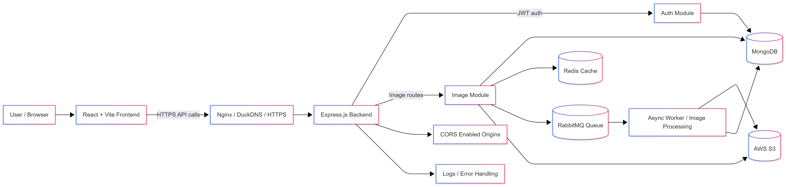
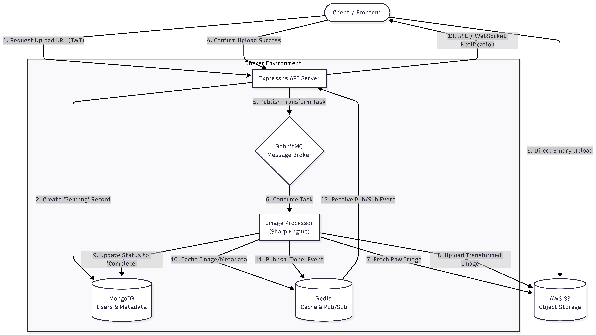

# Image Processing Service



The Image Processing Service allows users to upload, retrieve, delete, list, and transform images stored in AWS S3. The system uses asynchronous processing for image transformations and integrates managed cloud services for scalability and reliability.

---

## Features

- User authentication using JWT
- Upload, retrieve, delete, and list images from AWS S3
- Image transformation using the Sharp library
- Cache transformed images using Redis
- Asynchronous image processing using RabbitMQ
- Secure file storage using AWS S3
- Reverse proxy and HTTPS support using Nginx
- Frontend deployed on Vercel
- Backend hosted on AWS EC2
- Managed cloud services for MongoDB, Redis, and RabbitMQ
- CI/CD pipeline using GitHub Actions
- Automatic frontend deployment on Vercel
- Automated backend deployment workflow using GitHub Actions

---

## Architecture

- **Frontend** → React + Vite deployed on Vercel
- **Backend** → Node.js + Express hosted on AWS EC2
- **Database** → Managed MongoDB service
- **Cache Layer** → Managed Redis service
- **Message Queue** → Managed RabbitMQ service
- **Storage** → AWS S3
- **Reverse Proxy** → Nginx with HTTPS
- **CI/CD** → GitHub Actions

---

## Tech Stack

- Node.js
- Express.js
- MongoDB
- Redis
- RabbitMQ
- AWS S3
- Sharp
- Nginx
- AWS EC2
- React
- Vite
- Vercel
- GitHub Actions

---

## Repository Structure

```bash
Image-Processing-Service/
│
├── auth/
├── configs/
├── images/
├── models/
├── utils/
├── uploads/
├── img/
├── client/
├── .github/
│   └── workflows/
│
├── Dockerfile
├── docker-compose.yml
├── index.js
├── package.json
└── README.md
```

---

## High-Level Design (HLD)

Place architecture diagrams inside the `img/` folder.

Recommended filenames:

```text
img/arch.png
img/hld-network.png
img/hld-sequence.png
```

Reference images in README using relative paths:

```md

```

---

## Environment Variables

Create a `.env` file in the project root.

```env
MONGODB_URI=

JWT_SECRET=

AWS_ACCESS_KEY=
AWS_SECRET_KEY=
AWS_REGION=
AWS_BUCKET_NAME=

REDIS_URL=
RABBITMQ_URL=

PORT=5000
```

---

## Local Development

### Clone Repository

```bash
git clone <repository-url>
cd Image-Processing-Service
```

---

### Install Dependencies

```bash
npm install
```

---

### Configure Environment Variables

Create a `.env` file in the root directory and add the required values.

---

### Start Development Server

```bash
npm run dev
```

Server runs on:

```text
http://localhost:5000
```

---

## Frontend Development

Frontend is located inside the `client/` directory.

### Install Frontend Dependencies

```bash
cd client
npm install
```

### Start Frontend

```bash
npm run dev
```

Frontend runs on:

```text
http://localhost:5173
```

---

## Production Deployment

### Backend Deployment

The backend is deployed on an AWS EC2 instance using:

- Ubuntu
- Nginx reverse proxy
- HTTPS using Certbot
- PM2 process manager

Nginx proxies traffic to:

```text
http://localhost:5000
```

---

### Frontend Deployment

The frontend is deployed separately on Vercel.

Environment variable required:

```env
VITE_API_BASE_URL=https://your-backend-domain.com
```

---

## CI/CD Pipeline

The project uses GitHub Actions for automated deployment workflows.

### Frontend CI/CD

- Every push to the `main` branch automatically triggers a Vercel deployment.
- Preview deployments are generated for feature branches.

### Backend CI/CD

GitHub Actions automates backend deployment to AWS EC2 by:

- Pulling the latest code from GitHub
- Installing dependencies
- Restarting the Node.js process
- Keeping the production server updated automatically

Workflow files are located inside:

```text
.github/workflows/
```

---

## Nginx Configuration Notes

Increase upload limit for larger image uploads:

```nginx
client_max_body_size 20m;
```

Reload Nginx after configuration changes:

```bash
sudo systemctl reload nginx
```

---

## Common Issues

### 413 Request Entity Too Large

Increase Nginx upload size limit:

```nginx
client_max_body_size 20m;
```

---

### CORS Errors

Ensure backend CORS allowlist includes the frontend domain:

```text
https://your-frontend.vercel.app
```

---

### Redis / RabbitMQ Connection Issues

Verify:

- service availability
- correct connection URLs
- network access permissions

---

### AWS S3 Upload Issues

Verify:

- AWS credentials
- bucket permissions
- region configuration

---

## Future Improvements

- Add monitoring and centralized logging
- Add health-check endpoints
- Add Kubernetes deployment pipeline
- Add rate limiting and API security enhancements
- Add auto-scaling infrastructure support

---

## License

Private project.
